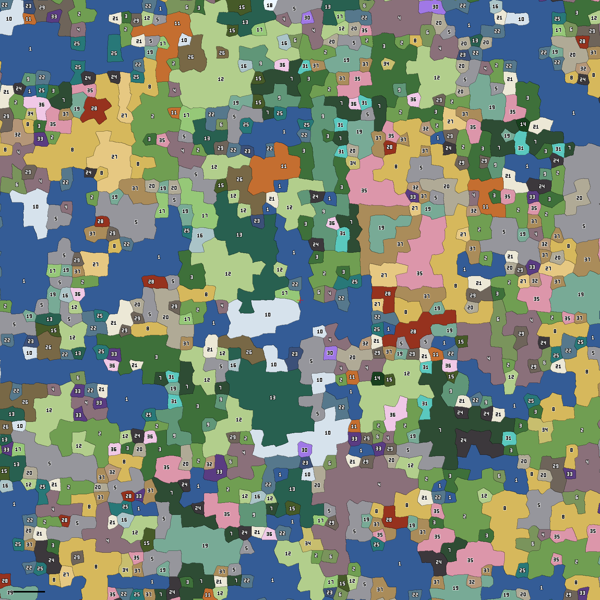
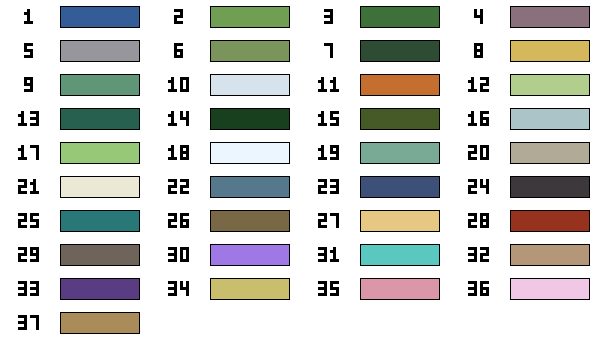

# Lands: list and transition map, for approval (M6a)

Generated by `npm run lands` (`tools/lands.mjs`) from the game's land registry (`src/js/world/lands.js`), seed 123456789, over 16000 x 16000 blocks around X 0, Z 0. Do not edit by hand: change the registry and run the tool again. Decision D-039; questions Q108, Q118, Q119, Q124, Q131 and Q134 in `docs/DIRECTION_QA.md`.

**For the owner to approve before M6b starts (Q134):** the land list (families, tiers, climate), the transition map, the signature landmark and feature of each land, and the layout in the picture below. Each family's PR builds its lands' looks in the places shown here.

## Open questions

1. **Elder Wood and Ancient Giant Wood overlap.** Both are old, damp temperate woods. The draft keeps both: Elder Wood stays the common mixed old wood (oaks, birches, undergrowth), and Ancient Giant Wood is a rare land of giant trees over forty blocks tall. The alternative is to rework Elder Wood into Ancient Giant Wood, as the Fens become Willow Vales.
2. **The Grey Shore and the Lake are edges, not lands.** The Grey Shore is the beach wherever land meets the sea, and lakes lie inside other lands, so neither has a size or neighbours. Coast lands (Chalk Cliffs, Fjords, Black Sand Shores) replace the grey beach along their own coasts when they are built in M6d.
3. **Names are drafts.** Each stretch's name uses the naming style of a people (the `p` column). Human, halfling, elf, gnome, orc, drow and beastfolk styles are still drafts awaiting approval (Q28).

## How lands are laid out

- **Cells.** The world is cut into cells about 320 blocks across, each centre shifted by up to a quarter of a cell, with borders warped so they wander. Each cell takes one land.
- **Climate.** Each cell's land is drawn from the lands that best fit the climate at its centre: warmth (cold, cool, temperate, warm, hot), damp (dry, middling, wet), relief (low, hills, high) and whether it is sea, or land beside the sea. Within the best fits the draw is weighted by tier: common 6, uncommon 2, rare 1.
- **Common lands grow.** A cell takes a settled neighbour's land eight times in ten when that land is common and suits it (two in ten when uncommon, never when rare), so common lands spread over several cells and rare ones stay single cells.
- **Borders blend.** Ground heights blend over about 35 blocks either side of a border (55 at the sea and moors, 110 at mountains), and the two lands mix in patches across the band.
- **Until a land is built** it shows as the old land in the "Shown as" column, so the world stays playable and each family's PR changes only how its lands look, never where they are.

## The map

Each number is a land from the list below; the colours are in the legend. One pixel is 10 blocks; the red cross is X 0, Z 0 (north is up); the black bar is 1000 blocks.

## The land list

Share: of all land on the map (for sea lands, of the whole map). Regions: lands wholly inside the map, with the median side of a square of the same area.

| # | Land | Family | Tier | Warmth | Damp | Relief | Shown as until built | Signature landmark | Signature feature | Share | Regions (median side) |
|---|---|---|---|---|---|---|---|---|---|---|---|
| 1 | The Western Sea | Old lands | common | cold to hot | sea | open sea | built | a wreck on the shoals | sea stacks | 17.7% | 24 (641) |
| 2 | Green Hills | Old lands | common | cool to warm | middling | low, hills | built | an earthwork hill fort | a lone great oak on a knoll | 9.1% | 41 (465) |
| 3 | Elder Wood | Old lands | common | temperate to warm | middling to wet | low | built | a moss-grown woodland shrine | a hollow elder you can walk into | 5.6% | 32 (356) |
| 4 | Heath Moors | Old lands | common | cool to temperate | dry to middling | low, hills | built | a watch cairn on a tor | granite tors | 7.2% | 26 (525) |
| 5 | High Mountains | Old lands | common | cold to warm | dry to wet | high | built | a gatehouse in a high pass | a high tarn under the peaks | 8.8% | 38 (530) |
| 6 | Barrow Hills | Old lands | uncommon | cool to temperate | dry to middling | low, hills | built | a great chambered barrow | long rows of standing stones | 1.7% | 16 (354) |
| 7 | Shadowed Forest | Old lands | uncommon | temperate to hot | wet | low, hills | built | a temple sunk among the roots | a fallen giant spanning a hollow | 4.2% | 19 (549) |
| 8 | Golden Steppe (was Windswept Plains) | Dry and fiery (M6e) | common | temperate to hot | dry | low, hills | Windswept Plains | a ring of horse stones | a lone rock outcrop over the grass | 9.0% | 24 (559) |
| 9 | Willow Vales (was Fens) | Forests (M6b) | common | temperate to warm | wet | low | Fens | a stilt house over the water | willow-ringed pools with islets | 2.7% | 14 (640) |
| 10 | Frozen Tundra (was Northern Fells) | Highlands and cold (M6c) | common | cold | dry to middling | low, hills | Northern Fells | a frozen longhouse | frost mounds and ice wedges | 2.8% | 11 (431) |
| 11 | Autumn Woods | Forests (M6b) | common | cool to temperate | middling | low, hills | Elder Wood | a woodcutters' lodge | a red-leaf glade around a still pond | 1.7% | 8 (340) |
| 12 | Birch Glades | Forests (M6b) | common | cool to temperate | middling to wet | low, hills | Elder Wood | a birch-bark shrine | a ring of white birches round a clearing | 8.9% | 26 (479) |
| 13 | Pine Highlands | Forests (M6b) | common | cold to cool | middling to wet | hills, high | Northern Fells | a timber watch post | a lookout rock above the pines | 4.9% | 7 (693) |
| 14 | Ancient Giant Wood | Forests (M6b) | rare | temperate to warm | wet | low | Elder Wood | a platform ruin high in a giant tree | a giant tree over forty blocks tall | 0.1% | 2 (340) |
| 15 | Yew Wood | Forests (M6b) | uncommon | cool to temperate | middling to wet | low, hills | Shadowed Forest | a ruined archers' hall | an ancient hollow yew | 0.8% | 11 (322) |
| 16 | Silverwood | Forests (M6b) | uncommon | cool to temperate | middling to wet | low, hills | Elder Wood | a moon-gate arch | a silver-leaf grove round a spring | 0.6% | 7 (345) |
| 17 | Alpine Meadows | Highlands and cold (M6c) | uncommon | cold to temperate | middling to wet | high | High Mountains | a shepherd's hut on the high pasture | a meadow tarn under a peak | 1.2% | 13 (336) |
| 18 | Glacier Fields | Highlands and cold (M6c) | uncommon | cold | dry to wet | high | High Mountains | a tower bound in the ice | crevasses and ice caves | 0.0% | 0 (0) |
| 19 | Cloud Forest Heights | Highlands and cold (M6c) | uncommon | temperate to hot | middling to wet | high | High Mountains | a mist shrine on a crag | mossy falls into the cloud | 4.9% | 26 (332) |
| 20 | Karst Crags | Highlands and cold (M6c) | uncommon | cool to warm | dry to middling | hills, high | Heath Moors | a hermitage in a cliff | a great sinkhole into the caves | 2.8% | 28 (341) |
| 21 | Chalk Cliffs | Coasts and waters (M6d) | uncommon | cool to warm | dry to wet | low, hills, beside the sea | Green Hills | a beacon tower on the cliff top | a chalk sea arch | 1.8% | 25 (326) |
| 22 | Rocky Isles | Coasts and waters (M6d) | uncommon | cold to hot | sea | sea by the coast | The Western Sea | a ruined chapel on an isle | sea arches and stacks | 2.2% | 32 (347) |
| 23 | Fjords | Coasts and waters (M6d) | uncommon | cold to cool | dry to wet | hills, high, beside the sea | High Mountains | a boathouse at a fjord's head | a fall from the fjord wall | 0.4% | 8 (318) |
| 24 | Black Sand Shores | Coasts and waters (M6d) | uncommon | temperate to hot | dry to wet | low, beside the sea | Windswept Plains | a black-stone harbour wall | basalt columns on the shore | 1.7% | 20 (330) |
| 25 | Kelp Shallows | Coasts and waters (M6d) | uncommon | temperate to hot | sea | sea by the coast | The Western Sea | a sunken causeway | kelp forests | 1.3% | 24 (336) |
| 26 | Raised Bogs | Coasts and waters (M6d) | uncommon | cold to temperate | wet | low | Fens | an old plank trackway across the bog | a domed bog with pools and cotton grass | 1.5% | 5 (707) |
| 27 | Southern Drylands | Dry and fiery (M6e) | common | hot | dry | low, hills | Windswept Plains | a temple half buried in sand | a dry wadi with an old well | 1.8% | 11 (525) |
| 28 | Volcanic Wastes | Dry and fiery (M6e) | uncommon | warm to hot | dry | hills, high | Heath Moors | a ruined fire shrine | a smoking cone with a lava lake held in rock | 1.3% | 10 (451) |
| 29 | Blighted Lands | Dry and fiery (M6e) | uncommon | cool to warm | dry to middling | low, hills | Heath Moors | a dead lord's ruined hall | grey dead trees and ash pools | 2.1% | 25 (311) |
| 30 | Crystal Barrens | Strange lands (M6f) | rare | cold to cool | dry | hills, high | Northern Fells | a crystal cutters' ruin | crystal spires | 0.3% | 3 (350) |
| 31 | Glowcap Hollows | Strange lands (M6f) | rare | temperate to warm | wet | low, hills | Shadowed Forest | a mushroom dwelling | giant glowing mushrooms in a hollow | 0.8% | 12 (342) |
| 32 | Petrified Forest | Strange lands (M6f) | rare | warm to hot | dry | low, hills | Windswept Plains | a waystation turned to stone | trees of stone | 0.7% | 11 (319) |
| 33 | Starfall Craters | Strange lands (M6f) | rare | cool to warm | dry to middling | low, hills | Heath Moors | a ruined star tower | a crater round a starmetal heart | 0.9% | 15 (323) |
| 34 | Overgrown Farmland | Old lands of men (M6g) | uncommon | cool to warm | middling | low | Green Hills | an abandoned manor farm | wild crops in old furrows | 0.5% | 6 (438) |
| 35 | Wild Orchards | Old lands of men (M6g) | uncommon | temperate to hot | middling | low | Green Hills | an orchard keeper's cottage | rows of gnarled fruit trees | 4.5% | 23 (450) |
| 36 | Flower Meadows | Old lands of men (M6g) | uncommon | temperate to warm | middling to wet | low | Green Hills | a shrine wreathed in flowers | bands of wildflowers | 0.9% | 12 (331) |
| 37 | Old Terraces | Old lands of men (M6g) | uncommon | temperate to hot | dry to middling | hills | Green Hills | a terraced village ruin | stone-walled terraces down a hillside | 3.6% | 32 (330) |

Every land is shown somewhere within 25600 blocks of the middle on this seed (checked by `36-lands`). Lands with no region inside the map above are further out.

## Sizes (Q118)

No land may be smaller than 215 x 215 blocks or narrower than 115. On this map the smallest land wholly inside it is 263 blocks on a side (as a square of the same area), the median 345. Common lands: median 479; uncommon 336; rare 323. Corner tips where four cells meet, under 30 x 30 blocks and lost in the border blend, are not counted as lands (9 on this map). The test `36-lands` checks width: every part of a land lies inside a 115-block circle of that land except the tips of its corners, and a few lands meet another stretch of the same kind at a narrow pinch (counted in the test's output).

## The transition map (Q108)

Two lands may border each other when their warmth is at most one band apart and their damp at most one band apart, unless one of them names the other below. The sea may meet any land. The table lists, for each land, the lands it may **not** border; every other pair may meet.

| # | Land | Warmth | May not border |
|---|---|---|---|
| 1 | The Western Sea | cold to hot | none |
| 2 | Green Hills | cool to warm | none |
| 3 | Elder Wood | temperate to warm | Frozen Tundra, Glacier Fields |
| 4 | Heath Moors | cool to temperate | Southern Drylands |
| 5 | High Mountains | cold to warm | none |
| 6 | Barrow Hills | cool to temperate | Southern Drylands |
| 7 | Shadowed Forest | temperate to hot | Golden Steppe, Frozen Tundra, Glacier Fields, Southern Drylands, Volcanic Wastes, Crystal Barrens, Petrified Forest |
| 8 | Golden Steppe | temperate to hot | Shadowed Forest, Willow Vales, Frozen Tundra, Ancient Giant Wood, Glacier Fields, Raised Bogs, Glowcap Hollows |
| 9 | Willow Vales | temperate to warm | Golden Steppe, Frozen Tundra, Glacier Fields, Southern Drylands, Volcanic Wastes, Crystal Barrens, Petrified Forest |
| 10 | Frozen Tundra | cold | Elder Wood, Shadowed Forest, Golden Steppe, Willow Vales, Ancient Giant Wood, Cloud Forest Heights, Black Sand Shores, Kelp Shallows, Southern Drylands, Volcanic Wastes, Glowcap Hollows, Petrified Forest, Wild Orchards, Flower Meadows, Old Terraces |
| 11 | Autumn Woods | cool to temperate | Southern Drylands |
| 12 | Birch Glades | cool to temperate | Southern Drylands |
| 13 | Pine Highlands | cold to cool | Southern Drylands, Volcanic Wastes, Petrified Forest |
| 14 | Ancient Giant Wood | temperate to warm | Golden Steppe, Frozen Tundra, Glacier Fields, Southern Drylands, Volcanic Wastes, Blighted Lands, Crystal Barrens, Petrified Forest |
| 15 | Yew Wood | cool to temperate | Southern Drylands |
| 16 | Silverwood | cool to temperate | Southern Drylands, Volcanic Wastes, Blighted Lands |
| 17 | Alpine Meadows | cold to temperate | Southern Drylands |
| 18 | Glacier Fields | cold | Elder Wood, Shadowed Forest, Golden Steppe, Willow Vales, Ancient Giant Wood, Cloud Forest Heights, Black Sand Shores, Kelp Shallows, Southern Drylands, Volcanic Wastes, Glowcap Hollows, Petrified Forest, Wild Orchards, Flower Meadows, Old Terraces |
| 19 | Cloud Forest Heights | temperate to hot | Frozen Tundra, Glacier Fields |
| 20 | Karst Crags | cool to warm | none |
| 21 | Chalk Cliffs | cool to warm | none |
| 22 | Rocky Isles | cold to hot | none |
| 23 | Fjords | cold to cool | Southern Drylands, Volcanic Wastes, Petrified Forest |
| 24 | Black Sand Shores | temperate to hot | Frozen Tundra, Glacier Fields |
| 25 | Kelp Shallows | temperate to hot | Frozen Tundra, Glacier Fields |
| 26 | Raised Bogs | cold to temperate | Golden Steppe, Southern Drylands, Volcanic Wastes, Crystal Barrens, Petrified Forest |
| 27 | Southern Drylands | hot | Heath Moors, Barrow Hills, Shadowed Forest, Willow Vales, Frozen Tundra, Autumn Woods, Birch Glades, Pine Highlands, Ancient Giant Wood, Yew Wood, Silverwood, Alpine Meadows, Glacier Fields, Fjords, Raised Bogs, Crystal Barrens, Glowcap Hollows |
| 28 | Volcanic Wastes | warm to hot | Shadowed Forest, Willow Vales, Frozen Tundra, Pine Highlands, Ancient Giant Wood, Silverwood, Glacier Fields, Fjords, Raised Bogs, Crystal Barrens, Glowcap Hollows |
| 29 | Blighted Lands | cool to warm | Ancient Giant Wood, Silverwood, Overgrown Farmland, Wild Orchards, Flower Meadows |
| 30 | Crystal Barrens | cold to cool | Shadowed Forest, Willow Vales, Ancient Giant Wood, Raised Bogs, Southern Drylands, Volcanic Wastes, Glowcap Hollows, Petrified Forest |
| 31 | Glowcap Hollows | temperate to warm | Golden Steppe, Frozen Tundra, Glacier Fields, Southern Drylands, Volcanic Wastes, Crystal Barrens, Petrified Forest |
| 32 | Petrified Forest | warm to hot | Shadowed Forest, Willow Vales, Frozen Tundra, Pine Highlands, Ancient Giant Wood, Glacier Fields, Fjords, Raised Bogs, Crystal Barrens, Glowcap Hollows |
| 33 | Starfall Craters | cool to warm | none |
| 34 | Overgrown Farmland | cool to warm | Blighted Lands |
| 35 | Wild Orchards | temperate to hot | Frozen Tundra, Glacier Fields, Blighted Lands |
| 36 | Flower Meadows | temperate to warm | Frozen Tundra, Glacier Fields, Blighted Lands |
| 37 | Old Terraces | temperate to hot | Frozen Tundra, Glacier Fields |

On the map every pair of neighbouring lands is allowed by this table (checked by `36-lands` over a wider area).
